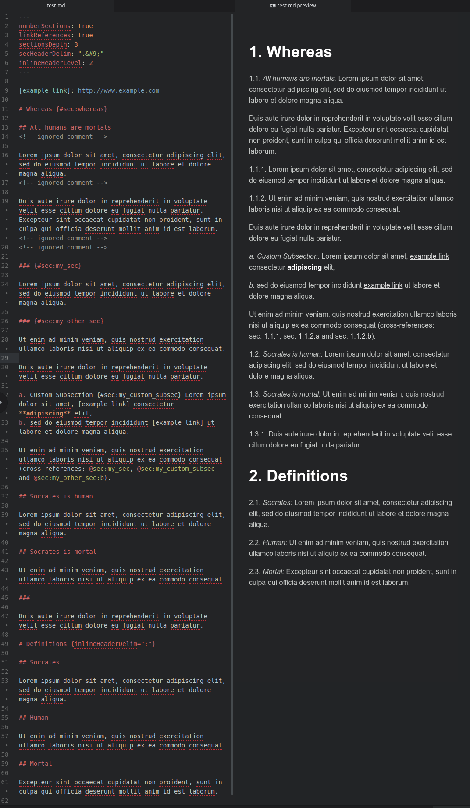

# WORK IN PROGRESS!!!

inline-headers.lua and crossref-ordered-list.lua are ready to be tested

This readme needs to be updated, too.


# inline-headers, now rewritten in Lua

Pandoc filter to render headers as inline headers in html, docx and odt conversion, while keeping header ids (and cross-references), rewritten in Lua.

Even if it can used as the only pandoc filter, it is intended to be used in cascade after [pandoc-crossref](http://lierdakil.github.io/pandoc-crossref/).

Inline header delimiters, as well as inline numbering and header styles, can be customized globally and/or for a specific chapter.

**NEW:** With the additional crossref-ordered-list filter (used in cascade *before* pandoc-crossref), it can handle also markdown ordered lists, converting them into "native" pandoc-crossref ordered lists, that can be referenced by adding the item's number or letter to section identifier (like `@sec:mysection:a`).

Here is an example of the filter in action with html preview:



and here is an example of conversion of the same example text to odt:


## 1. Installation

### 1.1. Lua Package

Simply copy the lua filter in the filters config directory of pandoc

```bash
cp inline-headers.lua ~/.pandoc/filters
```

### 1.2. (Highly) Recommended Pandoc Filters

1. [Pandoc-crossref](http://lierdakil.github.io/pandoc-crossref/) is not necessary but **highly recommended**, because **without it, you cannot exploit all the features of pandoc-inline-headers**. To install it, you may just download the latest release file from the corresponding [github page](https://github.com/lierdakil/pandoc-crossref/releases), and install the `pandoc-crossref` binary to a directory included in your PATH (like `usr/local/bin` or the like).
2. Moreover, if you want to convert to odt, you need also a patched version odt-custom-styles lua filter by [jzeneto](https://github.com/jzeneto/) -- see my pull request [here](https://github.com/jzeneto/pandoc-odt-filters/pull/3). You have to download both [odt-custom-styles.lua](https://raw.githubusercontent.com/alpianon/pandoc-odt-filters/preserve-tabs-patch/odt-custom-styles.lua) and [util.lua](https://raw.githubusercontent.com/alpianon/pandoc-odt-filters/master/util.lua) and put them in your lua filters directory (tipically, `~/.pandoc/filters/`).

## 2. Usage

### 2.1. Basics

#### 2.1.1. YAML Configuration Variables

```yaml
---
numberSections: true
linkReferences: true
sectionsDepth: 3
secHeaderDelim: ".&#9;"
inlineHeaderLevel: 2
---
```

The first four variables are relative to the `pandoc-crossref` filter: we activate section numbering, automatic creation of reference links, third level section depth, and a section header number delimiter (period followed by tab) that will be useful when converting to docx or odt formats (note that the 'tab' character must be written as the corresponding html character code -- `&#9;` -- otherwise it is ignored by `pandoc-crossref`).

The last variable is the one that 'activates' `inline-section-headers`. It means that all headers, whose level is 2 or higher, will be rendered as inline headers. Such parameter automatically activates also the `crossref-ordered-list` filter (see below), that can be activated also (if for some reason you do not want inline section headers but you do want ordered lists converted to `pandoc-crossref` sections) by setting `crossrefOrderedList: true`.

Of course you can choose level 3, 4, etc. as inlineHeaderLevel. Instead, putting values below 2 will not produce any effect -- so first level headers cannot be rendered as inline headers (this feature may be added in the future).

And, of course, you can use different values for `pandoc-crossref` variables (you should refer to its [documentation](http://lierdakil.github.io/pandoc-crossref/)): the values shown above are just an example of a typical usage of `pandoc-inline-headers` together with `pandoc-crossref`.

#### 2.1.2. Markdown Syntax

Just write your markdown documents as usual, keeping in mind that all headers, whose level is equal to or greater than the `inlineHeaderLevel` variable, will be rendered as inline headers.

Section identifiers (like `{#sec:my_section}`) will be kept, and cross-references (like `@sec:my_section`) will be correctly rendered even if they refer to inline headers.

Comments within the text or between section header and section text (like `<!-- comment -->`) are kept but ignored.

You can use also empty headers, like:

```markdown
###

I'm a section without header
```

that will be rendered (if you use `pandoc-crossref`) as follows:

>1.2.3. I'm a section without header

even if in such cases it is recommended to put a unique section identifier:

```markdown
### {#sec:no_header_section}

I'm a section without header
```

<span id=ordered_lists>As for ordered lists</span>, if you use crossref-ordered-list filter *before* pandoc-crossref and pandoc-inline-headers, they can be rendered and referenced through pandoc-crossref.

If you want to reference an ordered list item, you can just use the automatically created identifier (`#PARENT_SECTION_ID:ITEM_NUMBER`, f.e. `#sec:my_section:a`), but, if you want a **custom identifier that does not change** if you change the position of the list item or you add other items), you can set it with a syntax like

```markdown
a. {#sec:my_custom_id} item text.
```

Here is an example of the code with html preview:


Please note the use of `sectionsDepth` to choose at which level ordered list numbers/letters have to be rendered without the parent section number(s) - i.e. `a. item` instead of `1.1.a. item` - and also note that, when refencing ordered list items, parent section numbers are always included, regardless of the `sectionsDepth` value (exactly as one may expect).

#### 2.1.3. Markdown Preview in Editor

If you use a markdown preview plugin in your favourite text editor, you should include the three filters `crossref-ordered-list`, `pandoc-crossref` and `pandoc-inline-headers` (in this precise order) in pandoc rendering settings.

You should choose a markdown preview plugin that does not modify the markdown code before passing it to pandoc, otherwise you may get wrong or misleading output. F.e. markdown-preview-plus for Atom seem to work correctly with pandoc-inline-headers.

You can also use [markdown-preview-enhanced](https://github.com/shd101wyy/markdown-preview-enhanced), that **since version 0.16.2** works well with pandoc-inline-headers.

#### 2.1.4. Converting to html, docx, odt

Pandoc-inline-headers must be used in cascade after `pandoc-crossref` (and before `odt-custom-styles.lua`, when converting to odt), while crossref-ordered-list must be put before it.

##### a) HTML

A typical command to convert to html would be:

```
pandoc -p -t html \
  --filter=crossref-ordered-list \
  --filter=pandoc-crossref \
  --filter=pandoc-inline-headers \
  --o test.html test.md
```

##### b) docx

To convert to docx you have to do first:

```
pandoc -p -t docx \
  --filter=crossref-ordered-list \
  --filter=pandoc-crossref \
  --filter=pandoc-inline-headers \
  --o test.docx -p test.md
```

>Please note the `-p` (or `--preserve-tabs`) option, needed if you need tabs in your output document

Then you should edit `example.docx` and change the custom paragraph styles created by the filter, that are named 'Customlist 1 start', 'Customlist 1', 'Customlist 2 start', 'Customlist 2', and so on (styles with 'start' at the end of the name are applied to the first paragraph of a section; styles without 'start' are applied to the following paragraphs).

You may use appropriate tab values in paragraph styles, that, together with the section header number delimiter suggested above (period followed by tab, or `.&#9;`) may lead to nice results like in the example images at the beggining of this README.

When you are satisfied of your model, just save it (say, as `test_model.docx`) and use it in your pandoc command:

```
pandoc -p -t docx \
  --filter=crossref-ordered-list \
  --filter=pandoc-crossref \
  --filter=pandoc-inline-headers \
  --reference-doc=test_model.docx \
  --o test.docx -p test.md
```

&nbsp;

##### c) odt

Converting to odt is a little bit more complicated, since pandoc does not support odt custom styles yet (there is an [open issue](https://github.com/jgm/pandoc/issues/2106) about that on github). There is a [lua filter written by jzeneto](https://github.com/jzeneto/pandoc-odt-filters) as a workaround for such issue, but such filter:

- does not support tabs (so that you will have to use my patched version -- see installation instructions above) and
- does not support the creation of custom styles if they are not found in the model, so you will have to create your model document first, and manually add the needed custom styles (named like explained above for docx conversion).

Afterwards, you will be able to convert to odt in this way:
```
pandoc -p -t odt \
  --filter=crossref-ordered-list \
  --filter=pandoc-crossref \
  --filter=pandoc-inline-headers \
  --lua-filter=odt-custom-styles.lua \
  --reference-doc=test_model.odt \
  --o test.odt -p test.md
```

### 2.2. Advanced Use

#### 2.2.1. Customization of inline header delimiters and styles

The most important advanced feature you may need is customization of inline header delimiters and styles. This may be done globally (by putting the variable value in YAML metadata at the beginning of the markdown document, like `inlineHeaderDelim: ':'`) and/or for the subsections of a specific 'main' section header -- i.e., if you set inlineHeaderLevel to 2, a 'main' section header is a level 1 header (example: `# my level 1 section {#sec:my_sec inlineHeaderDelim=":" inlineHeaderStyle="bold"}`).

##### inlineHeaderDelim

Sequence of characters put after an inline section header and before section text.
If the section header title is empty, it is not rendered. Setting a different value (say, colon ':') only for a specific section may be useful if, for example, its subsections contain definitions (like in the example images at the beginning of this README).

*default value:* '.'

##### inlineHeaderStyle

Style for inline headers.

*possible values:*

'plain', 'normal', 'standard' (will be all rendered as plain text)

'emph', 'emphasis', 'italic' (will be all rendered as italic)

'bold', 'strong' (will be all rendered as bold)

*default value:* 'emph'

##### inlineHeaderNumStyle

Style for inline header numbers. Used only if you use also pandoc-crossref, and only if you set a different value for `secHeaderDelim` and for `chapDelim` (for instance, if `chapDelim` is set to the default value `.`, you have to set `secHeaderDelim` to, for example, `.&nbsp;` or `.&#9;` as suggested above)

*possible values:* same as inlineHeaderStyle

*default value:* 'plain'

##### inlineHeaderParStyle, inlineHeaderParStyleStart

Pandoc uses two paragraphs: one at the beginning of the text, one for the follow-on paragraphs (usually, first paragraph, text body), to follow the convention that first paragraphs have no leading indent. The same happens with pandoc-inline-headers.py.
Style names will be generated as follows:	To override the standard default values, you can add one or both of these parameters. They will be rendered according to the following convention:

```
{inlineHeaderParStyle} {level} {inlineHeaderParStyleStart}
{inlineHeaderParStyle} {level}
```

Therefore, The actual name of the styles, using

```
{inlineHeaderParStyle="Mystyle" inlineHeaderParStyleStart="first"}
```

will be, when converted:  

```markdown
# heading 1
Mystyle 1 first
Mystyle 1
## Heading 2
Mystyle 2 first
Mystyle 2
### Heading 3
Mystyle 3 first
Mystyle 3
```

 etc.

*default values:* 'Customlist'  'start'

#### 2.2.2. Ordered lists

As for ordered lists (like `a) ... b) ...`), you may 'use' them even without the `crossref-ordered-list` filter, but please keep in mind that, **because of a [pandoc bug/issue](https://github.com/jgm/pandoc/issues/4697), they cannot be rendered in odt or in docx conversion** with a custom *list* style, but only with a custom *paragraph* style; but with ordered lists, paragraph style customization is of little use, because, among other things, *paragraph* syle indents are overrided by *list* style indents (so you will always get the indents set in the default list style, regardless of the level/indentation of the "parent" section).

In other words, you cannot customize standard ordered list styles in docx and odt; this is the reason why it is preferable to render them as "native" pandoc-crossref lists (so you can even reference them, as explained in the [Basics section](#ordered-lists))
