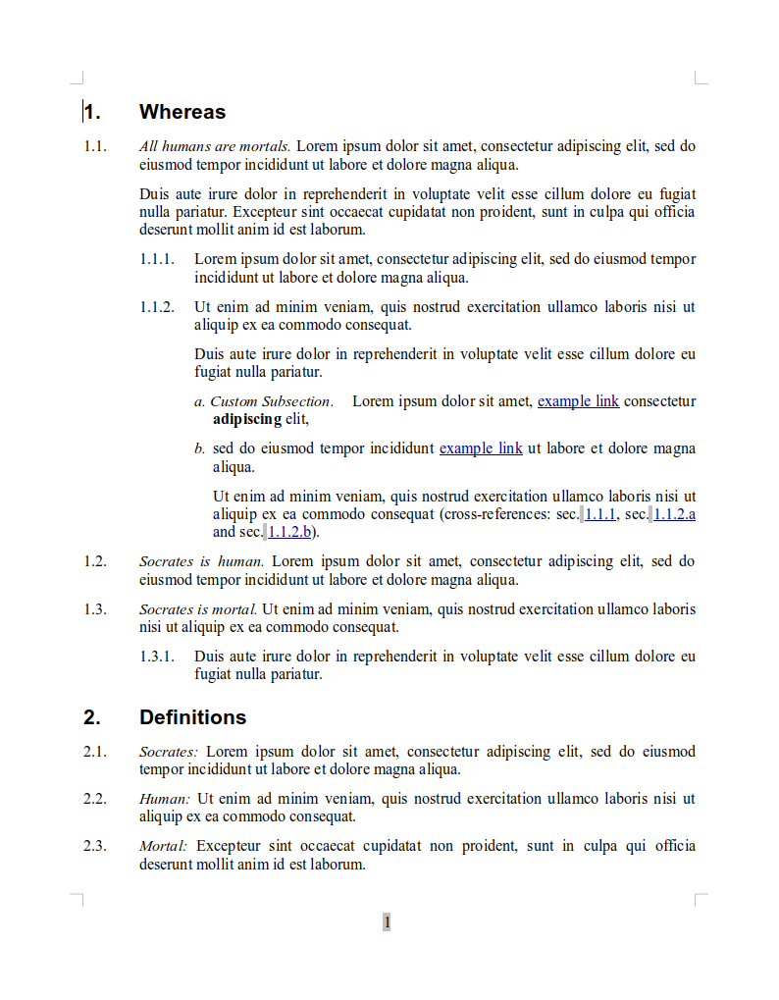

# pandoc-inline-headers

Pandoc filter to render headers as inline headers in html, docx and odt conversion, while keeping header ids (and cross-references).

Even if it can used as the only pandoc filter, it is intended to be used in cascade after [pandoc-crossref](http://lierdakil.github.io/pandoc-crossref/).

Inline header delimiters, as well as inline numbering and header styles, can be customized globally and/or for a specific chapter.

Here is an example of the filter in action with html preview:


and here is an example of conversion of the same example text to odt:



## 1. Installation

### 1.1. Mandatory

Pandoc-inline-header requires [Pandoc](https://github.com/jgm/pandoc/releases) and [Panflute](http://scorreia.com/software/panflute/). Assuming that you have already installed Pandoc, in order to install Panflute, just do `sudo pip3 install panflute` (or, if you want to install as user, `pip3 install --user panflute` -- but then check if your PATH contains also your user installation directory).

Then, just copy `pandoc-inline-headers.py` (mind to keep the `.py` suffix!) to a directory included in your PATH (like `usr/local/bin` or the like), and make sure it is executable (`sudo chmod +x /usr/local/bin/pandoc-inline-headers.py`).

### 1.2. Recommended

1. [Pandoc-crossref](http://lierdakil.github.io/pandoc-crossref/) is not necessary but highly recommended. To install it, you may just download the latest release file from the corresponding [github page](https://github.com/lierdakil/pandoc-crossref/releases), and install the `pandoc-crossref` binary to a directory included in your PATH (like `usr/local/bin` or the like).
2. Moreover, if you want to convert to odt, you need also a patched version odt-custom-styles lua filter by [jzeneto](https://github.com/jzeneto/) -- see my pull request [here](https://github.com/jzeneto/pandoc-odt-filters/pull/3). You have to download both [odt-custom-styles.lua](https://raw.githubusercontent.com/alpianon/pandoc-odt-filters/master/odt-custom-styles.lua) and [util.lua](https://raw.githubusercontent.com/alpianon/pandoc-odt-filters/master/util.lua) and put them in your lua filters directory (tipically, `~/.pandoc/filters/`).

## 2. Usage

### 2.1. Basics

#### 2.1.1. YAML Configuration Variables

```yaml
---
numberSections: true
linkReferences: true
sectionsDepth: -1
secHeaderDelim: ".&#9;"
inlineHeaderLevel: 2
---
```

The first four variables are relative to the `pandoc-crossref` filter: we activate section numbering, automatic creation of reference links, unlimited section depth, and a section header number delimiter (period followed by tab) that will be useful when converting to docx or odt formats (note that the 'tab' character must be written as the corresponding html character code -- `&#9;` -- otherwise it is ignored by `pandoc-crossref`).

The last variable is the one that 'activates' `inline-section-headers`. It means that all headers, whose level is 2 or higher, will be rendered as inline headers.

Of course you can choose level 3, 4, etc. as inlineHeaderLevel. Instead, putting values below 2 will not produce any effect -- so first level headers cannot be rendered as inline headers (this feature may be added in the future).

#### 2.1.2. Markdown Syntax

Just write your markdown documents as usual, keeping in mind that all headers, whose level is equal to or greater than the `inlineHeaderLevel` variable, will be rendered as inline headers.

Section identifiers (like `{#sec:my_section}`) will be kept, and cross-references (like `@sec:my_section`) will be correctly rendered even if they refer to inline headers.

Comments within the text or between section header and section text (like `<!-- comment -->`) are kept but ignored.

You can use also empty headers, like:
```markdown
###

I'm a section without header
```

that will be rendered (if you use `pandoc-crossref`) as follows:

>1.2.3. I'm a section without header

even if in such cases it is recommended to put a unique section identifier:

```markdown
### {#sec:no_header_section}

I'm a section without header
```

#### 2.1.3. Markdown Preview in Editor

If you use an editor with embedded markdown preview rendered with pandoc, you should choose a markdown preview plugin that does not modify the markdown code before passing it to pandoc (like f.e. markdown-preview-plus for Atom), otherwise you may get wrong or misleading output.

Unfortunately, one of the most widely used markdown preview packages for Atom, [markdown-preview-enhanced](https://github.com/shd101wyy/markdown-preview-enhanced), does not work well with pandoc-inline-headers (since it pre-processes markdown before sending it to pandoc), but I made some changes to a sub-component that should solve all the problems, and I am confident that my [pull request](https://github.com/shd101wyy/mume/pull/136) will be taken into consideration soon :)

#### 2.1.4. Converting to html, docx, odt

Pandoc-inline-headers must be used in cascade after `pandoc-crossref` (and before `odt-custom-styles.lua`, when converting to odt).

##### a) HTML

A typical command to convert to html would be:

```
pandoc -t html --filter=pandoc-crossref --filter=pandoc-inline-headers.py \
--o example.html example.md
```

##### b) docx

To convert to docx you have to do first:

```
pandoc -t docx \
  --filter=pandoc-crossref --filter=pandoc-inline-headers.py \
  --o example.docx example.md
```

then edit `example.docx` and change the custom paragraph styles created by the filter, that are named 'Customlist 1 start', 'Customlist 1', 'Customlist 2 start', 'Customlist 2', and so on (styles with 'start' at the end of the name are applied to the first paragraph of a section; styles without 'start' are applied to the following paragraphs).

You may use appropriate tab values in paragraph styles, that, together with the section header number delimiter suggested above (period followed by tab, or `.&#9;`) may lead to nice results like in the example images at the beggining of this README.

When you are satisfied of your model, just save it (say, as `example_model.docx`) and use it in your pandoc command:

```
pandoc -t docx \
  --filter=pandoc-crossref --filter=pandoc-inline-headers.py \
  --reference-doc=example_model.docx --o example.docx -p example.md
```

Please note the `-p` (or `--preserve-tabs`) option, needed if you need tabs in your output document.

##### c) odt

Converting to odt is a little bit more complicated, since pandoc does not support odt custom styles yet (there is an [open issue](https://github.com/jgm/pandoc/issues/2106) about that on github). There is a [lua filter written by jzeneto](https://github.com/jzeneto/pandoc-odt-filters) as a workaround for such issue, but such filter:

- does not support tabs (so that you will have to use my patched version -- see installation instructions above) and
- does not support the creation of custom styles if they are not found in the model, so you will have to create your model document first, and manually add the needed custom styles (named like explained above for docx conversion).

Afterwards, you will be able to convert to odt in this way:
```
pandoc -t odt --filter=pandoc-crossref --filter=pandoc-inline-headers.py \
--lua-filter=odt-custom-styles.lua --reference-doc=example_model.odt \
-o example.odt -p example.md
```

### 2.2. Advanced Use

The most important advanced feature you may need is customization of inline header delimiters and styles. This may be done globally (by putting the variable value in YAML metadata at the beginning of the markdown document, like `inlineHeaderDelim: ':'`) and/or for the subsections of a specific 'main' section header -- i.e., if you set inlineHeaderLevel to 2, a 'main' section header is a level 1 header (example: `# my level 1 section {#sec:my_sec inlineHeaderDelim=":" inlineHeaderStyle="bold"}`).

#### 2.2.1. inlineHeaderDelim

Sequence of characters put after an inline section header and before section text.
If the section header title is empty, it is not rendered. Setting a different value (say, colon ':') only for a specific section may be useful if, for example, its subsections contain definitions (like in the example images at the beginning of this README).

**default value:** '.'

#### 2.2.2. inlineHeaderStyle

Style for inline headers.

**possible values:**

'plain', 'normal', 'standard' (will be all rendered as plain text)

'emph', 'emphasis', 'italic' (will be all rendered as italic)

'bold', 'strong' (will be all rendered as bold)

**default value:** 'emph'

#### 2.2.3 inlineHeaderNumStyle

Style for inline header numbers. Used only if you use also pandoc-crossref, and only if you set a different value for `secHeaderDelim` and for `chapDelim` (for instance, if `chapDelim` is set to the default value `.`, you have to set `secHeaderDelim` to, for example, `.&nbsp;` or `.&#9;` as suggested above)

**possible values:** same as inlineHeaderStyle

**default value:** 'plain'

#### 2.2.4 inlineHeaderParStyle, inlineHeaderParStyleStart

Base name and suffix for the custom paragraph styles used in conversion to docx and odt.
Style names will be generated as follows:
```
{inlineHeaderParStyle} {level} {inlineHeaderParStyleStart}
{inlineHeaderParStyle} {level}

Customlist 1 start
Customlist 1
Customlist 2 start
Customlist 2
Customlist 3 start
Customlist 3

etc.
```
**default values:** 'Customlist'  'start'
